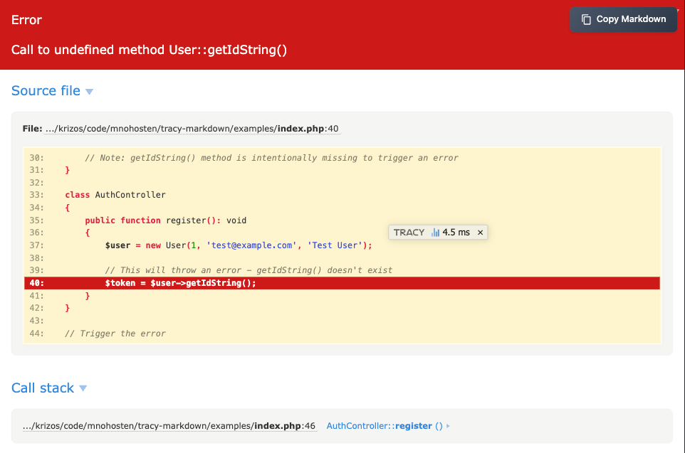

# Tracy Markdown

[](https://github.com/mnohosten/tracy-markdown)
[](https://php.net)
[](https://tracy.nette.org)
[](LICENSE)

A Tracy debugger extension that adds a "Copy Markdown" button to error reports. Perfect for AI-assisted development - simply click the button to copy a well-formatted error report that you can paste directly into your AI assistant (Claude, ChatGPT, etc.).



## Why Use This?

When developing with AI assistants, providing detailed error context helps get better solutions faster. This extension formats Tracy's error information into clean, readable Markdown that includes:

- Complete error details with proper formatting
- Source code context highlighting the exact line
- Full stack trace with file paths and line numbers
- HTTP request information (URL, method, parameters)
- Environment details (PHP version, timestamp)
- **Automatic sensitive data redaction** for security

## Installation

```bash
composer require mnohosten/tracy-markdown
```

## Quick Start

### Basic PHP Application

```php
<?php

use Tracy\Debugger;
use Mnohosten\TracyMarkdown\TracyMarkdownExtension;

// Enable Tracy debugger
Debugger::enable();

// Register the Markdown extension
TracyMarkdownExtension::register();
```

### Nette Framework

**Option 1: Bootstrap file**

In your `app/bootstrap.php`:

```php
<?php

use Tracy\Debugger;
use Mnohosten\TracyMarkdown\TracyMarkdownExtension;

Debugger::enable();
TracyMarkdownExtension::register();
```

**Option 2: DI Configuration**

In your `config/common.neon`:

```neon
services:
    - Mnohosten\TracyMarkdown\TracyMarkdownExtension::register()
```

### Symfony Framework

In your `config/packages/dev/tracy.yaml` or bootstrap:

```php
<?php

use Tracy\Debugger;
use Mnohosten\TracyMarkdown\TracyMarkdownExtension;

if (class_exists(Debugger::class)) {
    Debugger::enable();
    TracyMarkdownExtension::register();
}
```

## Features

### Visual Interface

When an error occurs, a **"Copy Markdown"** button appears in the top-right corner of Tracy's BlueScreen with:

- Modern, responsive design
- Hover and click animations
- Visual feedback (checkmark) when copied
- Works on both desktop and mobile browsers
- Fallback for browsers without Clipboard API

### Markdown Output Sections

The copied Markdown includes all essential debugging information:

#### 1. Error Information
- Exception class name
- Error message with special character escaping
- Error code (if present)

#### 2. Source File
- Complete file path with line number
- **Code snippet** with 5 lines of context before and after
- Line highlighting showing the exact error location

#### 3. Stack Trace
- Complete call stack with all frames
- File paths and line numbers for each frame
- Function/method names with arguments
- Formatted argument types (strings, ints, objects, arrays)

#### 4. Previous Exception
- Captured if the exception was caused by another
- Includes file location and message
- Helps trace root causes

#### 5. HTTP Request (Web Context)
- **URL**: Complete request URL
- **Method**: GET, POST, PUT, DELETE, etc.
- **GET Parameters**: Query string data (formatted JSON)
- **POST Parameters**: Form/body data (formatted JSON with **sensitive data redacted**)
- **Headers**: HTTP headers (Authorization and Cookie headers excluded)

#### 6. Environment
- PHP version
- Tracy version
- Timestamp of error occurrence

### Example Output

```markdown
# Error

**Exception**: Call to undefined method User::getIdString()

## Source file

**File**: `/var/www/app/Controller/AuthController.php:267`

\`\`\`php
   262 |     /**
   263 |      * Helper to send verification email.
   264 |      */
   265 |     private function sendVerificationEmail(User $user): void
   266 |     {
>  267 |         $token = $this->emailVerifications->createToken($user->getIdString(), $user->email);
   268 |         $verifyUrl = ($_ENV['APP_URL'] ?? 'http://localhost:8180') . '/auth/verify-email/' . $token;
   269 |
   270 |         try {
   271 |             $this->mailer->sendEmailVerification($user->email, $user->name, $verifyUrl);
\`\`\`

## Stack trace

\`\`\`
#0 /var/www/app/Controller/AuthController.php:245 App\Controller\AuthController->sendVerificationEmail(User)
#1 /var/www/vendor/slim/slim/Slim/Handlers/Strategies/RequestResponse.php:43 App\Controller\AuthController->register(Slim\Psr7\Request, Slim\Psr7\Response, array(0))
#2 [internal]:0 call_user_func(array(2))
\`\`\`

## Request

**URL**: `http://localhost:8180/auth/register`
**Method**: `POST`

### POST parameters

\`\`\`json
{
    "email": "test@example.com",
    "name": "Test User",
    "password": "***REDACTED***"
}
\`\`\`

### Headers

\`\`\`
Content-Type: application/json
Accept: application/json
User-Agent: Mozilla/5.0
\`\`\`

## Environment

- **PHP**: 8.4.15
- **Tracy**: 2.11.0
- **Date**: 2025-12-14 22:30:45
```

## Security Features

### Automatic Sensitive Data Redaction

The extension automatically detects and redacts sensitive information in POST data to prevent accidental exposure:

**Redacted Fields** (case-insensitive, partial matching):
- `password`, `passwd`, `pwd`
- `secret`
- `token`
- `api_key`, `apikey`
- `credit_card`, `cc`

**Example:**
```json
{
    "username": "john.doe",
    "password": "***REDACTED***",
    "user_token": "***REDACTED***",
    "email": "john@example.com"
}
```

**Nested Data Support:**
```json
{
    "user": {
        "name": "John",
        "password": "***REDACTED***"
    }
}
```

### Header Filtering

The following headers are automatically excluded from reports:
- `Authorization` - Prevents exposure of bearer tokens, API keys
- `Cookie` - Prevents session hijacking

## Browser Support

The extension uses modern Clipboard API with automatic fallback:

- **Modern browsers**: Uses `navigator.clipboard.writeText()` for secure, asynchronous copying
- **Older browsers**: Falls back to `document.execCommand('copy')` for compatibility
- **All browsers**: Shows visual feedback with checkmark animation

## Requirements

- **PHP**: 8.0 or higher
- **Tracy**: 2.9 or higher
- **Browser**: Any modern browser (Chrome, Firefox, Safari, Edge)

## Development

### Running Tests

```bash
# Install dependencies
composer install

# Run test suite
vendor/bin/phpunit

# Run with detailed output
vendor/bin/phpunit --testdox

# Run specific test
vendor/bin/phpunit --filter testFormatException
```

### Code Coverage

Install a coverage driver:

```bash
# PCOV (recommended - faster)
pecl install pcov

# OR Xdebug
pecl install xdebug
```

Generate coverage report:

```bash
# With PCOV
vendor/bin/phpunit --coverage-html coverage-html

# With Xdebug
XDEBUG_MODE=coverage vendor/bin/phpunit --coverage-html coverage-html

# View report
open coverage-html/index.html
```

### Test Coverage

The library maintains **100% code coverage** with **53 tests** and **134 assertions**:

- ✅ Exception formatting (all output sections)
- ✅ Request data collection and sanitization
- ✅ Sensitive data redaction (11 different patterns)
- ✅ Tracy BlueScreen integration
- ✅ Copy button rendering and interaction
- ✅ Edge cases (null values, missing data, XSS prevention)

See [TESTING.md](TESTING.md) for detailed coverage information.

### Static Analysis

```bash
# Install PHPStan
composer require --dev phpstan/phpstan

# Run analysis
vendor/bin/phpstan analyse src tests
```

## Architecture

### Class Structure

```
src/
├── TracyMarkdownExtension.php  # Main entry point, Tracy integration
├── MarkdownFormatter.php       # Exception → Markdown conversion
└── MarkdownPanel.php           # UI rendering (button, CSS, JS)
```

### Extension Points

The library is designed to be extensible:

```php
// Get the formatter instance for custom use
$extension = TracyMarkdownExtension::getInstance();
$formatter = $extension->getFormatter();

// Format any exception manually
$markdown = $formatter->formatException($exception);

// Collect request data manually
$requestData = $formatter->collectRequestData();
```

## Troubleshooting

### Button Not Appearing

**Check Tracy is enabled:**
```php
Debugger::$productionMode = false; // Force development mode
Debugger::enable(Debugger::Development);
```

**Verify extension is registered:**
```php
TracyMarkdownExtension::register();
// Must be called AFTER Debugger::enable()
```

### Copy Not Working

**Try the fallback method:**
- The extension automatically falls back to `document.execCommand('copy')`
- Check browser console for JavaScript errors
- Ensure the page is served over HTTPS (required for Clipboard API)

### Missing Request Data

**CLI mode:**
- Request data is only collected in web (non-CLI) context
- Use the formatter directly for CLI exceptions

## Contributing

Contributions are welcome! Please:

1. **Fork** the repository
2. **Create** a feature branch (`git checkout -b feature/amazing-feature`)
3. **Write tests** for new functionality
4. **Ensure** all tests pass (`vendor/bin/phpunit`)
5. **Maintain** 100% code coverage
6. **Commit** your changes (`git commit -m 'Add amazing feature'`)
7. **Push** to the branch (`git push origin feature/amazing-feature`)
8. **Open** a Pull Request

### Code Style

- Follow PSR-12 coding standard
- Use strict types (`declare(strict_types=1)`)
- Add PHPDoc blocks for public methods
- Write descriptive commit messages

## FAQ

**Q: Does this work with Tracy Bar?**
A: This extension specifically adds functionality to Tracy's BlueScreen (error page). It doesn't modify the Tracy Bar.

**Q: Can I customize the Markdown output?**
A: Currently, the format is fixed. If you need customization, you can extend `MarkdownFormatter` and override the `formatException()` method.

**Q: Is sensitive data really redacted?**
A: Yes, the extension uses pattern matching to detect 11 common sensitive field patterns and replaces values with `***REDACTED***`. However, always review output before sharing.

**Q: What about files uploaded via POST?**
A: File uploads appear as their metadata only (filename, size, type). File contents are never included.

**Q: Can I use this in production?**
A: Tracy itself should only run in development. This extension follows the same principle - it only activates when Tracy's BlueScreen is shown.

## Changelog

See [CHANGELOG.md](CHANGELOG.md) for release history.

## License

MIT License - see [LICENSE](LICENSE) file for details.

## Credits

Created by [Martin Krizan](https://martinkrizan.com)

Built with:
- [Tracy](https://tracy.nette.org) - PHP debugging tool by David Grudl
- [PHPUnit](https://phpunit.de) - Testing framework

## Support

- **Issues**: [GitHub Issues](https://github.com/mnohosten/tracy-markdown/issues)
- **Documentation**: [GitHub Wiki](https://github.com/mnohosten/tracy-markdown/wiki)
- **Discussions**: [GitHub Discussions](https://github.com/mnohosten/tracy-markdown/discussions)

---

**Happy debugging!** 🐛 → 📋 → 🤖
